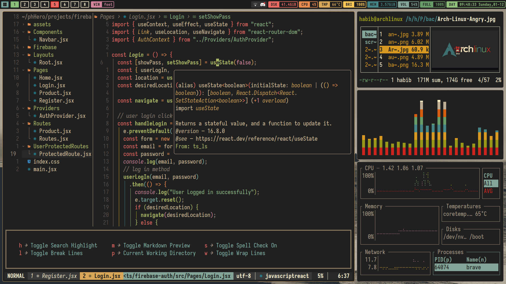

# My workstation configs

- The colorscheme is a combmination of both gruvbox and gruvbox-material in my configs

## **Descriptions:**

- **OS:** Arch Linux
- **Window Manager:** i3,swaywm,hyprland
- **Bar:** polybar,waybar
- **Launcher:** rofi,fuzzel
- **Compositor:** picom
- **Terminal:** alacritty,wezterm,kitty,foot
- **Code Editor** : Neovim
- **Lockscreen:** i3lock,swaylock
- **File Manager:** pcmanfm
- **Fonts:** jetbrainsmono nerd font, roboto-condensed, font-awesome (No longer using Iosevka , since jetbrainsmono just works with any terminal)
- **Policykit:** mate-polkit

# Notes ⚠️

[Important Notes](./arch_install/notes/notes.md)

[Wayland Notes](./arch_install/notes/wayland_notes.md)

[Arch Installation Process I followed](./arch_install/notes/archInstalltion.md)

Packages I used in my System:

##### Currently using an ultrabook: HP probook 10 G450, i5 13th gen with iGPU - intel iris xe.

- [Drivers](./arch_install/scripts/drivers.sh)
- [System Packages](./arch_install/scripts/system_packages.sh)
- [GUI Apps](./arch_install/scripts/applications.sh)

---

## Apps in each workspace

| Workspace Number |   Assigned Apps    |
| :--------------: | :----------------: |
|        1         |      Terminal      |
|        2         |      Browser       |
|        3         | Development/Coding |
|        4         |    File Manager    |
|        5         |        Chat        |
|        6         |    Design tools    |
|        7         |    Office tools    |
|        8         |    System tools    |

---

## Gallery

### i3wm + polybar


### Sway / Hyprland + waybar




### App launcher and power menu: Rofi


## Keybindings For i3

|    Keybindings    |        Actions        |
| :---------------: | :-------------------: |
|       mod+t       |      Tiling Mode      |
|       mod+e       |       Tab Mode        |
|       mod+s       |     Stacking Mode     |
|       mod+d       |       rofi drun       |
|       alt+d       |       rofi run        |
|       alt+w       |     rofi windows      |
|       alt+m       |      rofi emoji       |
|    mod+Shift+e    |      Power Menu       |
|    mod+return     |    Kitty terminal     |
|    mod+Shift+q    |    Kills a window     |
| mod+ctrl+vim keys |     resize window     |
|       mod+z       |      horizontal       |
|       mod+a       |       vertical        |
|       mod+m       |   toggle fullscreen   |
|     mod+space     |    floating window    |
|       mod+q       | focus floating window |
|       mod+p       |     focus parent      |
|       mod+w       |        firefox        |
|       mod+n       |        pcmanfm        |

---

## Neovim: Grimm Vim:

#### Not a distro but my own personal config ⚠️

##### Keymaps:

- All the keymaps can be found in the `.config/nvim/lua/grimmvim/core/keymaps.lua` file.
- Keymaps for `substitute.nvim` is in its plugin file: `.config/nvim/lua/grimmvim/plugins/substitute.lua`
- Press `<leader>fk` to find available keymaps.

### Neovim Gallery :

##### Start Page


##### LSP Support


##### Markdown


##### Gitsigns plugin for visual git status


##### ToggleTerm X Lazygit


##### Plugin Manager : Lazy and LSP manager : Mason


#### Installation Guide :

- remove or backup the `nvim` folder from the following directory :

  - `~/.config/nvim`
  - `~/.cache/nvim`
  - `~/.local/share/nvim`
  - `~/.local/state/nvim`

- Now copy my `nvim` config folder in the `~/.config` directory

#### Neovim File tree

```
.
├── init.lua
├── lazy-lock.json
└── lua
    └── grimmvim
        ├── core
        │   ├── init.lua
        │   ├── keymaps.lua
        │   ├── lazy.lua
        │   └── options.lua
        └── plugins
            ├── alpha.lua
            ├── autopairs.lua
            ├── cmp.lua
            ├── colorizer.lua
            ├── colorscheme.lua
            ├── comments.lua
            ├── dressing.lua
            ├── filetree.lua
            ├── gitsigns.lua
            ├── indent.lua
            ├── lsp
            │   ├── formatting.lua
            │   ├── lspconfig.lua
            │   ├── lspsaga.lua
            │   └── mason.lua
            ├── lualine.lua
            ├── luasnip.lua
            ├── markdown.lua
            ├── notify.lua
            ├── session.lua
            ├── substitute.lua
            ├── surround.lua
            ├── tagbar.lua
            ├── telescope.lua
            ├── toggleTerm.lua
            ├── treesitter.lua
            ├── utilities.lua
            └── whichkey.lua
```
