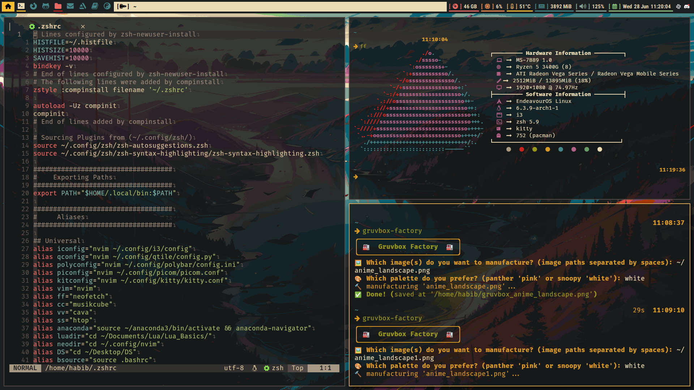
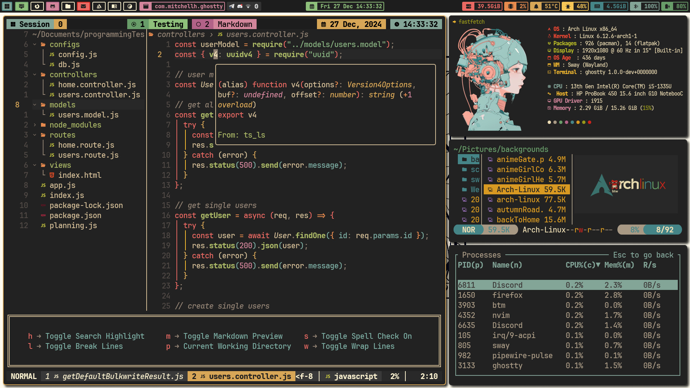
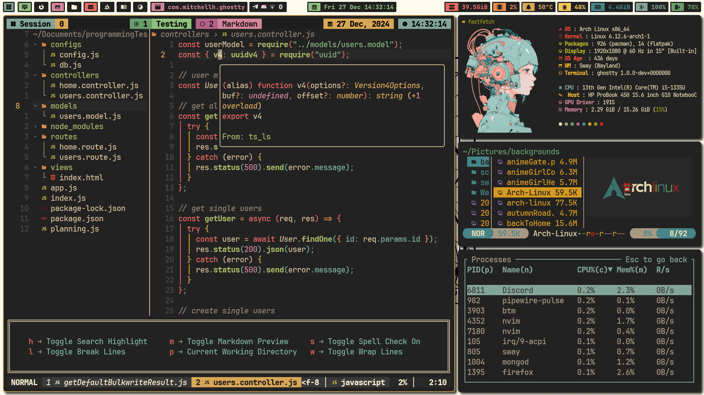
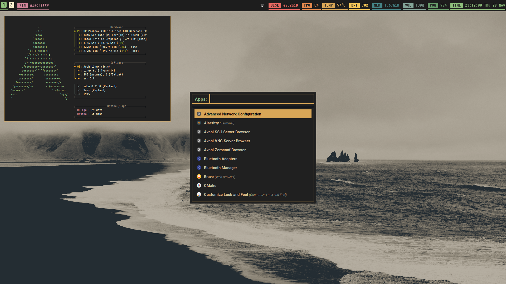
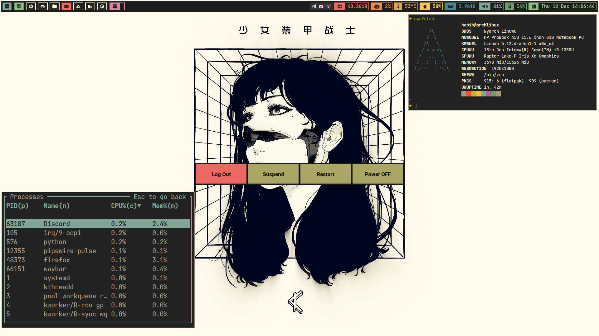
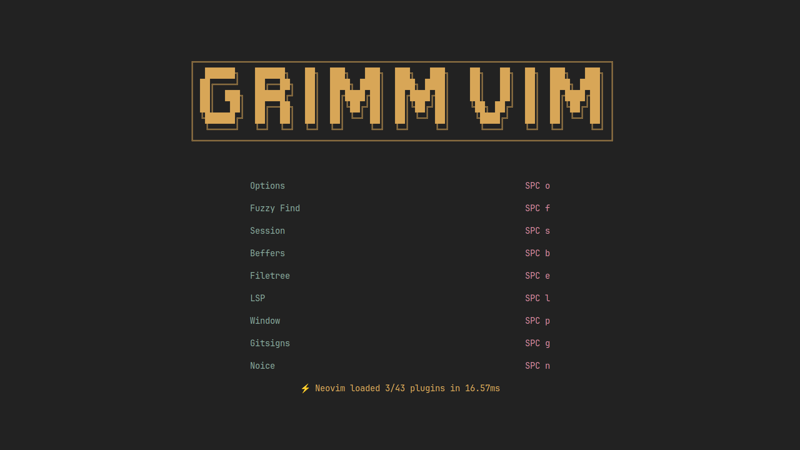
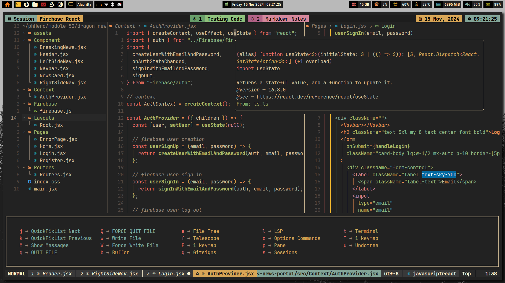
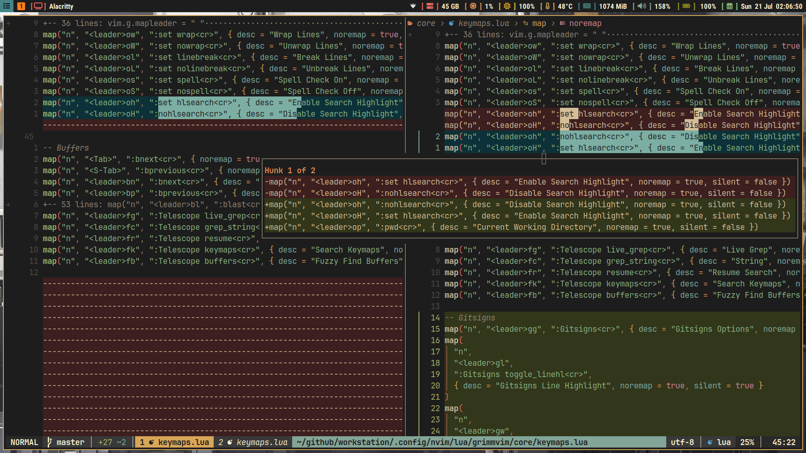
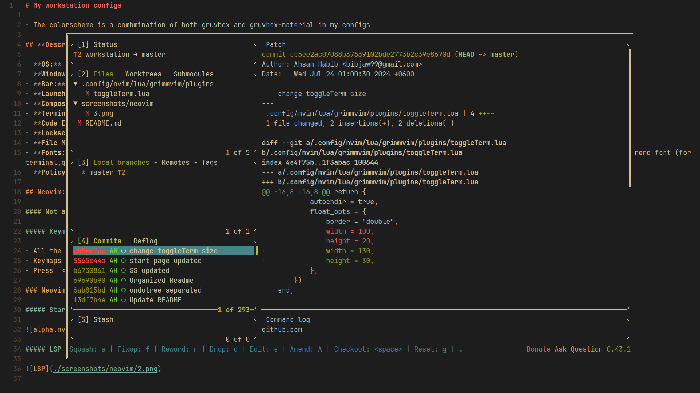
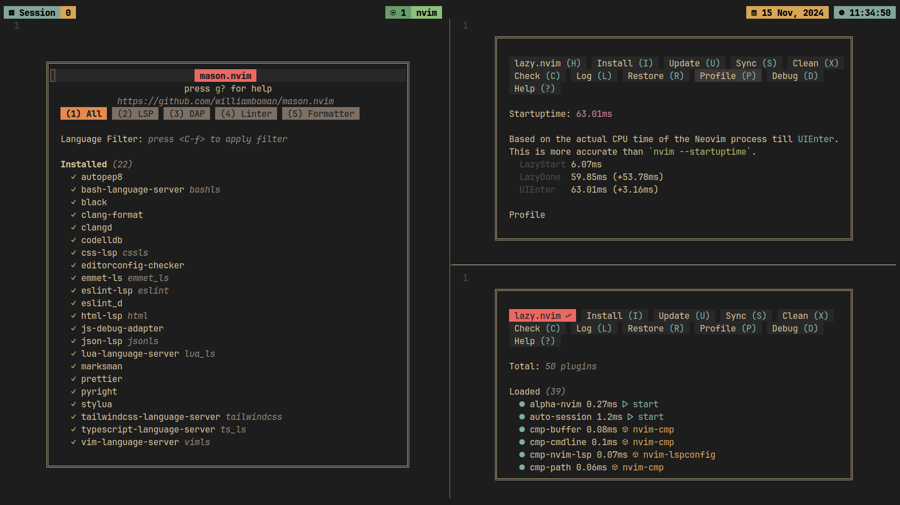

# My workstation configs

- The colorscheme is a combmination of both gruvbox and gruvbox-material in my configs

## **Descriptions:**

- **OS:** Arch Linux
- **Window Manager:** i3,swaywm,hyprland
- **Bar:** polybar,waybar
- **Launcher:** rofi
- **Compositor:** picom (for xorg)
- **Terminal:** ghostty
- **Code Editor** : Neovim
- **Lockscreen:** i3lock,swaylock,hyprlock
- **File Manager:** nemo
- **Fonts:** jetbrainsmono nerd font, roboto-condensed, font-awesome, iosevkaterm nerd font
- **Policykit:** mate-polkit

## Installation script :

```sh
curl -s https://raw.githubusercontent.com/bibjaw99/workstation/refs/heads/master/install_scripts/install.sh | bash
```

## how the script works :

- all the dotfiles will be stored in a folder called `dotfiles` in your `$HOME/.local/share` directory
- then if the config already exists in the `$HOME/.config` directory then it will be backed up in the `$HOME/.config.backup` directory
- then a symlink will be created from `$HOME/.local/share/dotfiles` directory to the `$HOME/.config` directory
  - **why this approach instead of using/creating actual directories ? :** it's easy to dump them all togather in the github project folder after making huge changes in multiple app configs
- names of the config directories and config files that needs to be symlinked, must be listed in the respected files in `workstation/install_scripts/config_lists`.
  - check `symlink_configs.sh` and `symlink_files.sh` to understand it better

## folder structure of my install script :

- if you already finished the base arch installation just clone the repo
- run the `$HOME/github/workstation/install_scripts/install.sh` script
- before installing you can check the list of the Packages in the install_scripts directory and modify it according to your likings
  - just go to `/workstation/install_scripts/package_lists` directory to find all the list of packages

```sh
├── config_lists
│   ├── config_dirs.txt
│   └── config_files.txt
├── flatpak_install.sh
├── install.sh
├── package_install.sh
├── package_lists
│   ├── common_pkg_list.txt
│   ├── dev_pkg_list.txt
│   ├── flatpak_pkg_list.txt
│   ├── wayland_pkg_list.txt
│   └── xorg_pkg_list.txt
├── symlink_configs.sh
└── symlink_files.sh
```

# Notes

- [Important Notes](./arch_install/notes/notes.md)
- [Arch Installation Process I followed](./arch_install/notes/archInstalltion.md)

### Drivers:

##### Currently using an ultrabook: HP probook 10 G450, i5 13th gen with iGPU - intel iris xe.

```sh
# intel
xorg
xf86-video-amdgpu
xf86-video-ati
amd-ucode
amdvlk

# amd
intel-media-driver
vulkan-intel
intel-gmmlib
```

---

## Apps in each workspace

| Workspace Number |   Assigned Apps    |
| :--------------: | :----------------: |
|        1         |      Terminal      |
|        2         |      Browser       |
|        3         | Development/Coding |
|        4         |    File Manager    |
|        5         |        Chat        |
|        6         |    Design tools    |
|        7         |    Office tools    |
|        8         |    System tools    |

---

## Gallery

### i3wm + polybar



### Sway / Hyprland + waybar





### App launcher and power menu: Rofi




---

## Neovim: Grimm Vim:

#### Not a distro but my own personal config ⚠️

##### Keymaps:

- All the keymaps can be found in the `.config/nvim/lua/grimmvim/core/keymaps.lua` file.
- Keymaps for `substitute.nvim` is in its plugin file: `.config/nvim/lua/grimmvim/plugins/substitute.lua`
- Press `<leader>fk` to find available keymaps.

### Neovim Gallery :

##### Start Page



##### File Tree : mini.files



##### LSP Support and Autocompletion support


##### Gitsigns plugin for visual git status



##### ToggleTerm X Lazygit



##### Plugin Manager : Lazy and LSP manager : Mason



#### Installation Guide :

- remove or backup the `nvim` folder from the following directory :
  - `~/.config/nvim`
  - `~/.cache/nvim`
  - `~/.local/share/nvim`
  - `~/.local/state/nvim`

- Now copy my `nvim` config folder in the `~/.config` directory
