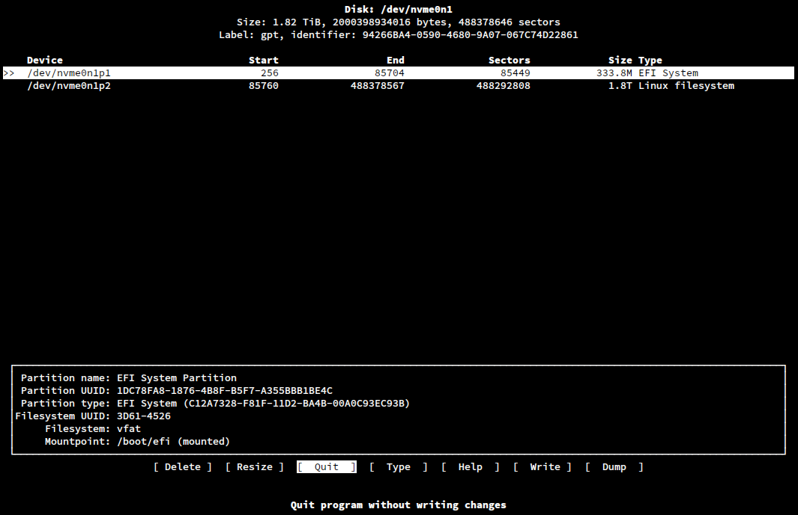

# <u>Installing Arch Linux</u> 🔥

## video references :

1. [Arch Linux Monthly Install: April 2022 - YouTube](https://www.youtube.com/watch?v=HIXnT178TgI&list=PL-odKaUzOz3JarNUoE7jMEL537pmjc1hn&index=21)

2. [How to install Arch Linux with the systemd-boot bootloader - YouTube](https://www.youtube.com/watch?v=FFXRFTrZ2Lk)

3. [Arch Linux Installation Guide 2020 - YouTube](https://www.youtube.com/watch?v=PQgyW10xD8s)

---

## Unusual things to do: [notes](./notes.md)

---

## Steps for installing arch in my pc

#### Step 1: Check Internet:

```
ip a
```

---

#### Step 2: Sync Time:

```
timedatectl  set-ntp ture
```

---

#### Step 3: Disk Management and Partitioning

```
lsblk
cfdisk /dev/nvme0n1
```

> ##### A ui will popup. Select the desired size of the partition of efi, root and home directory



---

#### Step 4: Formatting Disks

```
mkfs.fat -F32 /dev/nvme0n1p1
mkfs.ext4 /dev/nvme0n1p2
mkfs.ext4 /dev/nvme0n1p3
```

> ##### The 1st one is for /boot/efi
>
> ##### The 2nd one is for root /
>
> ##### The 3rd one is for /home

---

> ## Now that we have formatted the disk, we need to mount them

### Step 5: Mounting disks:

```
mount /dev/nvme0n1p2 /mnt

mkdir -p /mnt/boot
mount /dev/nvme0n1p1 /mnt/boot

mkdir /mnt/home
mount /dev/nvme0n1p3 /mnt/home
```

---

### Step 6: Base Installation:

```
pacstrap /mnt linux linux-headers linux-firmware base base-devel
efibootmgr networkmanager neovim mtools dosfstools
```

---

### Step 7: Generate fstab

```
genfstab -U /mnt >> /mnt/etc/fstab

# Check generated fstab file
cat /mnt/etc/fstab
```

---

### Step 8 : Leave the installation and go to chroot:

```
arch-chroot /mnt
```

---

### Step 9 : System Time

```
ln -sf /usr/share/zoneinfo/Asia/Dhaka /etc/localtime
hwclock --systohc
```

---

### Step 10: Locale

```
nvim /etc/locale.gen
# uncomment : en_US.UTF-8 UTF-8. write and quit vim

locale-gen

nvim /etc/locale.conf
# add the line : LANG = en_US.UTF-8
```

---

### Step 11: Hostname

```
nvim /etc/hostname
# Write down whatever hostname you want to choose
```

---

### Step 12: Setting up hosts

```
nvim /etc/hosts
# add the following line:
127.0.0.1  localhost
::1        localhost
127.0.1.1  <host name>.localdomain  <host name>
```

---

### Step 13: Root Password

```
passwd
```

---

### Step 14: SystemD boot as bootloader

```
bootctl --path=/boot install
cd /boot/loader
nvim loader.conf
# add the following line if not there
timeout 3
#console-mode keep
default <host name>-* # save and quit out of vim
```

---

### Step 15 : Entries Directory

> ##### in the /boot/loader there should be a entries directory.
>
> ##### Go there and add the following line :

```
cd entries/ # this is where the entries will be strored of the installed  distro
# add :
title  Arch Linux
linux vmlinuz-linux
initrd  /initramfs-linux.img
options  root=<root directory> # eg. in our case: /dev/nvme0n1p2 rw
```

---

### Step 16: User Creation

```
useradd -mG wheel habib350
passwd habib350
EDITOR=nvim visudo
# uncomment the following line
%wheel All=(All) All
```

---

### Setp 17: Final

```
exit
umount -a
```
