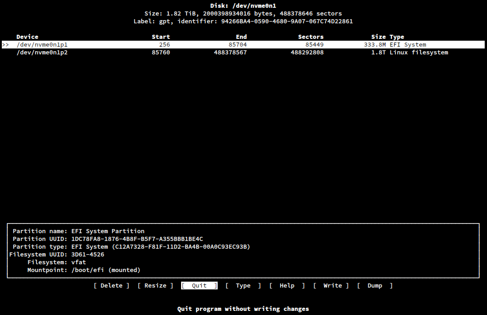

# <u>Installing Arch Linux</u> 🔥

## video references :

1. [Arch Linux Monthly Install: April 2022 - YouTube](https://www.youtube.com/watch?v=HIXnT178TgI&list=PL-odKaUzOz3JarNUoE7jMEL537pmjc1hn&index=21)

2. [How to install Arch Linux with the systemd-boot bootloader - YouTube](https://www.youtube.com/watch?v=FFXRFTrZ2Lk)

3. [Arch Linux Installation Guide 2020 - YouTube](https://www.youtube.com/watch?v=PQgyW10xD8s)

---

## Unusual things to do: [notes](./notes.md)

---

## Steps for installing arch in my pc

#### Step 1: Check Internet:

```
$ ip a
```

---

#### Step 2: Sync Time:

```
$ timedatectl  set-ntp true
```

---

#### Step 3: Disk Management and Partitioning

```
$ lsblk
$ cfdisk /dev/nvme0n1
```

> ##### A ui will popup. Select the desired size of the partition of efi, root and home directory



---

#### Step 4: Formatting Disks

```
$ mkfs.fat -F32 /dev/nvme0n1p1
$ mkfs.ext4 /dev/nvme0n1p2
$ mkfs.ext4 /dev/nvme0n1p3
```

> ##### The 1st one is for /boot/efi
>
> ##### The 2nd one is for root /
>
> ##### The 3rd one is for /home

---

> ## Now that we have formatted the disk, we need to mount them

### Step 5: Mounting disks:

```
$ mount /dev/nvme0n1p2 /mnt

# For grub boot-loader
$ mkdir -p /mnt/boot/efi
$ mount /dev/nvme0n1p1 /mnt/boot/efi

#For, systemdboot,
$ mkdir -p /mnt/boot/
$ mount /dev/nvme0n1p1 /mnt/boot/

$ mkdir -p /mnt/home
$ mount /dev/nvme0n1p3 /mnt/home
```

---

### Step 6: Base Installation:

```
# for grub boot-loader
$ pacstrap /mnt linux linux-headers linux-firmware base base-devel efibootmgr networkmanager neovim grub os-prober intel-ucode sof-firmware

# for systemdboot,
$ pacstrap /mnt linux linux-headers linux-firmware base base-devel efibootmgr networkmanager neovim mtools dosfstools intel-ucode sof-firmware
```

---

### Step 7: Generate fstab

```
$ genfstab -U /mnt >> /mnt/etc/fstab

# Check generated fstab file
$ cat /mnt/etc/fstab
```

---

### Step 8 : Leave the installation and go to chroot:

```
$ arch-chroot /mnt
```

---

### Step 9 : System Time

```
$ ln -sf /usr/share/zoneinfo/Asia/Dhaka /etc/localtime
$ hwclock --systohc
```

---

### Step 10: Locale

```
$ nvim /etc/locale.gen
# uncomment : en_US.UTF-8 UTF-8. write and quit vim

$ locale-gen

$ nvim /etc/locale.conf

# add the line
LANG = en_US.UTF-8
```

---

### Step 11: Hostname

```
$ nvim /etc/hostname
# Write down whatever hostname you want to choose
```

---

### Step 12: Setting up hosts

```
$ nvim /etc/hosts
# add the following line:
127.0.0.1   localhost
::1         localhost
127.0.1.1   <host name>.localdomain  <host name>
```

---

### Step 13: Root Password

```
$ passwd
```

---

### Step 14: User Creation

```
$ useradd -mG wheel <user_name>
$ passwd <user_name>
$ EDITOR=nvim visudo
# uncomment the following line
%wheel All=(All) All
```

---

### Step 15: setting up Bootloader

```
$ grub-install --target=x86_64-efi --efi-directory=/boot/efi --bootloader-id=GRUB
$ grub-mkconfig -o /boot/grub/grub.cfg
```

#### for systemd-boot

```sh
$ bootctl --path=/boot install
$ cd /boot/loader/
$ nvim loader.conf

# add the line(s)
default arch.conf # should be same name as the conf file in entries directory

$ cd entries/
$ nvim arch.conf

# add the lines
title	Arch Linux
linux	/vmlinuz-linux
initrd	/intel-ucode.img
initrd	/initramfs-linux.img
options	root=/dev/nvme0n1p2 rw quiet loglevel=3

$ nvim arch-fb.conf

# add the lines
title	Arch Linux Fallback Image
linux	/vmlinuz-linux
initrd	/intel-ucode.img
initrd	/initramfs-linux-fallback.img
options	root=/dev/nvme0n1p2 rw quiet loglevel=3

$ nvim arch-lts.conf

# add the lines
title	Arch Linux LTS
linux	/vmlinuz-linux-lts
initrd	/intel-ucode.img
initrd	/initramfs-linux-lts.img
options	root=/dev/nvme0n1p2 rw quiet loglevel=3

$ nvim arch-lts-fb.conf

# add the lines
title	Arch Linux LTS Fallback
linux	/vmlinuz-linux-lts
initrd	/intel-ucode.img
initrd	/initramfs-linux-lts-fallback.img
options	root=/dev/nvme0n1p2 rw quiet loglevel=3

$ nvim arch-zen.conf

# add the lines
title	Arch Linux Zen
linux	/vmlinuz-linux-zen
initrd	/intel-ucode.img
initrd	/initramfs-linux-zen.img
options	root=/dev/nvme0n1p2 rw quiet loglevel=3

$ nvim arch-zen-fb.conf

# add the lines
title	Arch Linux Zen Fallback
linux	/vmlinuz-linux-zen
initrd	/intel-ucode.img
initrd	/initramfs-linux-zen-fallback.img
options	root=/dev/nvme0n1p2 rw quiet loglevel=3
```

---

### Setp 16: Final

```
$ exit
$ umount -a
```
